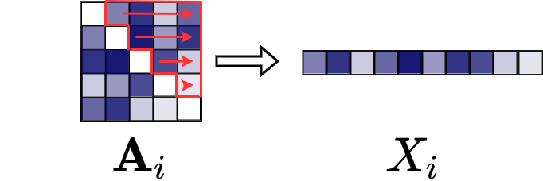

# Input for `BayesianNetworkRegression.jl`

The function `Fit!` within `BayesianNetworkRegression.jl` is the main method to estimate the relationships between the edges of the microbiome network (covariates) and the variable of interest (response). 

There are two alternatives for the network input data:

1. A vector of matrices, where each item in the vector (of length $n$, where $n$ is the sample size) is an $V \times V$ (where $V$ is the number of microbes in each sample) adjacency matrix describing the microbiome network. All adjacency matrices must be the same size.
2. A $n \times \frac{V(V-1)}{2}$ matrix, where each row in the matrix is the upper triangle of the adjacency matrix describing the network for that sample.

Note that the package does not assume any specific inference procedure for the estimation of the adjacency matrices (and thus, of the microbiome networks). This means that the microbiome networks can be obtained using the user's preferred methodology and simply input them into the package as described below.

## Tutorial data: Adjacency matrices 

Suppose that you design an experiment with $n$ different samples, and for each sample, you estimate a microbial network for $V$ microbes and a measured phenotype.

The $n$ microbial networks can be stored as $n$ adjacency matrices. We have a toy example where we stored the adjacency matrices as a JLD2 file with the [`JLD2.jl`](https://github.com/JuliaIO/JLD2.jl) package.

You have two files:
1. `vector_networks.jld2` contains a vector of adjacency matrices and
2. `vector_response.jld2` contains a vector of responses (real numbers).

You can access the example files for the networks 
[here](https://github.com/solislemuslab/BayesianNetworkRegression.jl/blob/main/examples/vector_networks.jld2)
and for the responses
[here](https://github.com/solislemuslab/BayesianNetworkRegression.jl/blob/main/examples/vector_response.jld2)

To load the data and view an example in julia do the following:
```julia
using BayesianNetworkRegression
using JLD2
cd(joinpath(dirname(pathof(BayesianNetworkRegression)), "..","examples"))

vector_networks = JLD2.load("vector_networks.jld2")
vector_response = JLD2.load("vector_response.jld2")

vector_networks["networks"][1] # shows the first adjancency matrix
vector_response["response"] # shows all responses

X_a = vector_networks["networks"]
y_a = vector_response["response"]
```

We will use the `X_a` and `y_a` objects in the `Fit!` function in the next section.

### Reading adjacency matrices from csv files

xxxx

## Tutorial data: Vectorized adjacency matrices

Suppose that you already converted each adjacency matrix into a vector corresponding to its upper triangle (see image below).



That is, you have a file with $n$ rows and $\frac{V(V-1)}{2} + 1$ columns. For each row, the first $\frac{V(V-1)}{2}$ columns describe the upper triangle of an adjacency matrix and the last column gives the response variable. 

You can access the example file of input networks (and response)
[here](https://github.com/solislemuslab/BayesianNetworkRegression.jl/blob/main/examples/matrix_networks.csv)

Do not copy-paste into a "smart" text-editor. Instead, save the file
directly into your working directory using "save link as" or "download linked file as".
This file contains 100 adjacency matrices and corresponding responses.

To load the data and view an example in julia do the following:
```julia
using CSV, DataFrames
cd(joinpath(dirname(pathof(BayesianNetworkRegression)), "..","examples"))

dat = DataFrame(CSV.File("matrix_networks.csv"))
X_v = Matrix(dat[:,1:435])
y_v = dat[:,436]
```

We will use the `X_v` and `y_v` objects in the `Fit!` function in the next section.
