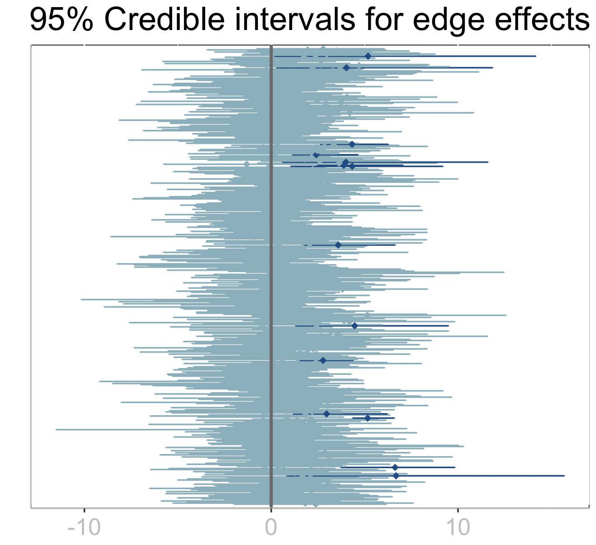
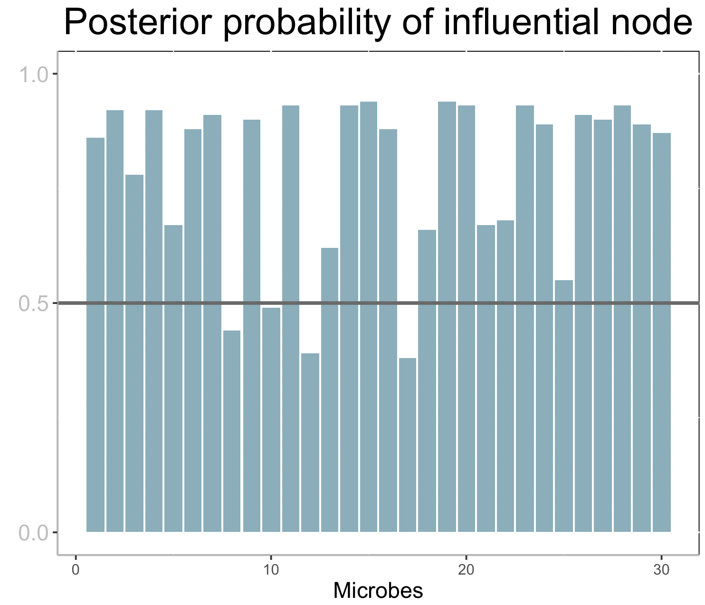

# Interpreting the Model Results

## Interpretation

From the [`Fit!`](@ref) and [`Summary`](@ref) functions in previous section, we end up with two tables summarizing the mean estimates for the regression coefficients for the edge effects (`out.edge_coef`) and the posterior probabilities that nodes are influential (`out.prob_nodes`):


```
julia> out.edge_coef
465×5 DataFrame
 Row │ node1  node2  estimate  lower_bound  upper_bound 
     │ Int64  Int64  Float64   Float64      Float64     
─────┼──────────────────────────────────────────────────
   1 │     1      1     2.677       -0.753        5.392
   2 │     1      2     2.573       -1.27         4.881
   3 │     1      3     2.106        0.207        3.876
  ⋮  │   ⋮      ⋮       ⋮           ⋮            ⋮
 463 │    29     29     9.074        5.199       13.233
 464 │    29     30     3.015       -1.028        7.793
 465 │    30     30     1.262       -1.334        4.296
                                        459 rows omitted

julia> out.prob_nodes
30×1 DataFrame
 Row │ probability 
     │ Float64     
─────┼─────────────
   1 │        1.0
   2 │        1.0
   3 │        1.0
  ⋮  │      ⋮
  28 │        1.0
  29 │        1.0
  30 │        1.0
    24 rows omitted
```

## Plot

The following R code can be used to plot the credible intervals of the edge regression coefficients. 

First, we pass the data frame to R:
```julia
edges = out.edge_coef

using RCall
@rput edges
```

An alternative path is to save the data frame to file with `CSV.write("edges.csv",out.edge_coef)` and then read in R.

In R, we type
```R
library(ggplot2)
library(tidyr)
nn <- length(edges$node1)
edges$edge <- 1:nn
edges <- transform(edges,rej=ifelse(lower_bound > 0 | upper_bound < 0,TRUE,FALSE))

plt <- edges %>% ggplot() + geom_errorbar(aes(x=factor(edge),ymin=lower_bound,
                                                                ymax=upper_bound,
                                                                color=rej)) +
        xlab("") + ylab("")+ ggtitle("95% Credible intervals for edge effects")+
        scale_color_manual(values=c("#82AFBC","#0E4B87")) + 
        theme(
            plot.title = element_text(hjust=0.5, size=rel(2)),
            axis.title.x = element_text(size=rel(1.2)),
            axis.title.y = element_text(size=rel(1.9), angle=90, vjust=0.5, hjust=0.5),
            axis.text.x = element_text(colour="grey", size=rel(1.8), hjust=.5, vjust=.5, face="plain"),
            axis.ticks.y = element_blank(),
            panel.background = element_rect(fill = NA, color = "black"),
            axis.line = element_line(colour = "grey"),
            strip.text = element_text(size = rel(1.5)),
            legend.position = "none"
        ) +
        coord_flip() + scale_x_discrete(labels=NULL,expand=expansion(add=4)) +
        geom_point(aes(x=factor(edge),y=estimate, color=rej),shape=18, size=2) +
        geom_hline(aes(yintercept=0),linetype="solid",color="#696969", size=1)
plt
```



The dark credible intervals are those that do not intersect zero which point at potential edges (interactions among microbes) that have a significant effect on the response.


The following R code can be used to plot posterior probabilities of being influencial nodes (micrones) on the response.

First, we pass the data frame to R:
```julia
nodes = out.prob_nodes

@rput nodes
```

An alternative path is to save the data frame to file with `CSV.write("nodes.csv",out.prob_nodes)` and then read in R.

```R
nodes$microbe <- 1:length(nodes$probability)

axisTextY = 

## Plot:
plt2 <- ggplot(data=nodes,aes(x=microbe,y=probability)) + 
    geom_bar(stat="Identity", fill="#82AFBC") + xlab("Microbes") + ylab("") + 
    ggtitle("Posterior probability of influential node") +
    theme(
        plot.title = element_text(hjust=0.5, size=rel(2)),
        axis.title.x = element_text(size=rel(1.2)),
        axis.title.y = element_text(size=rel(1.9), angle=90, vjust=0.5, hjust=0.5),
        axis.text.y = element_text(colour="grey", size=rel(1.5), angle=0, hjust=.5, vjust=.5, face="plain"),
        panel.background = element_rect(fill = NA, color = "black"),
        axis.line = element_line(colour = "grey"),
        strip.text = element_text(size = rel(2))
    ) +
    geom_hline(aes(yintercept=0.5),linetype="solid",color="#696969", size=1)+
    scale_y_continuous(breaks = c(0,0.5,1),limits=c(0,1))
plt2
```


Each bar corresponds to the posterior probability of being an influential node (microbe) on the response. A horizontal line is drawn at 0.5, so that nodes with bars taller than the line can be considered influential.